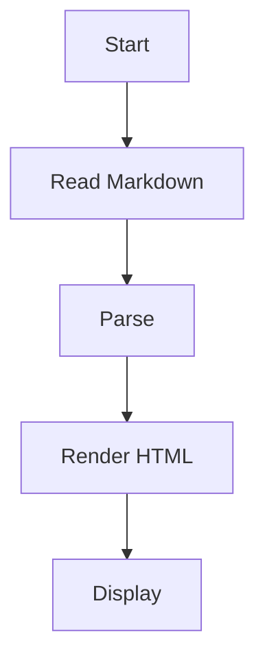
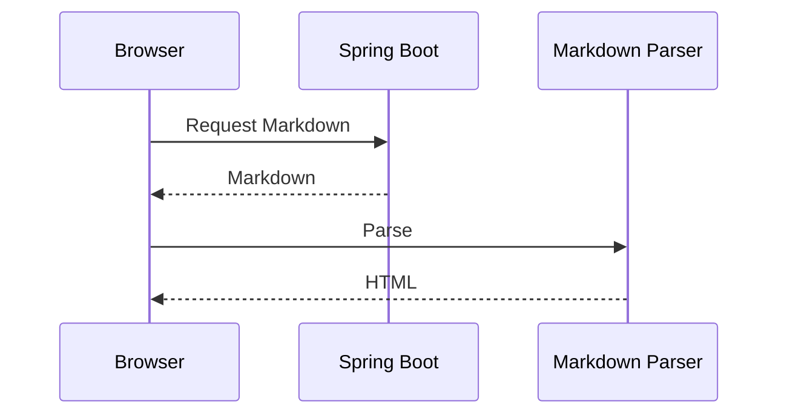

# Interactive Documentation Engine

Welcome to the **Interactive Documentation Engine**.

This page demonstrates almost every Markdown feature supported by the documentation system.

---

# Table of Contents

1. Introduction
2. Text Formatting
3. Lists
4. Task Lists
5. Tables
6. Images
7. Video
8. Audio
9. Links
10. Blockquote
11. Inline Code
12. Code Blocks
13. Code Highlighting
14. Horizontal Line
15. Details (Collapsible)
16. Keyboard Keys
17. Emoji
18. Mermaid Diagram
19. Math Formula
20. HTML Support
21. Alerts
22. Footnotes

---

# Introduction

Markdown allows you to create beautiful documentation quickly.

It supports headings, code, tables, images, videos, diagrams, and much more.

---

# Text Formatting

Normal text

**Bold**

*Italic*

***Bold + Italic***

~~Strikethrough~~

<u>Underline (HTML)</u>

<mark>Highlighted Text</mark>

---

# Lists

## Unordered List

- HTML
- CSS
- JavaScript
- React
- Next.js

### Nested List

- Frontend
  - HTML
  - CSS
  - JavaScript

- Backend
  - Spring Boot
  - Node.js

---

## Ordered List

1. Install Node.js
2. Install Next.js
3. Create Project
4. Run Project

---

# Task List

- [x] Heading
- [x] Paragraph
- [x] Image
- [x] Table
- [x] Code
- [x] Syntax Highlight
- [ ] Login
- [ ] Search

---

# Tables

| Language | Creator | Released |
|-----------|----------|-----------|
| HTML | Tim Berners-Lee | 1993 |
| CSS | Håkon Wium Lie | 1996 |
| JavaScript | Brendan Eich | 1995 |
| Java | James Gosling | 1995 |

---

## Alignment

| Left | Center | Right |
|:------|:------:|------:|
| HTML | CSS | JS |
| React | Vue | Angular |

---

# Images


---

# Video

<video controls width="700">
    <source src="/videos/demo.mp4" type="video/mp4">
</video>

---

# YouTube Video

<iframe
width="700"
height="400"
src="https://www.youtube.com/embed/W6NZfCO5SIk"
title="YouTube Video"
allowfullscreen>
</iframe>

---

# Audio

<audio controls>
    <source src="/audio/demo.mp3" type="audio/mpeg">
</audio>

---

# Links

Google

https://google.com

Next.js

https://nextjs.org

Spring Boot

https://spring.io/projects/spring-boot

---

# Blockquote

> Markdown is easy to learn.
>
> It is widely used for documentation.

---

# Inline Code

Install package using `npm install`.

Variable example:

`const name = "John";`

---

# Code Blocks

## HTML

```html
<!DOCTYPE html>
<html>
<head>
    <title>Hello</title>
</head>
<body>

<h1>Hello World</h1>

</body>
</html>
```

## CSS

```css
body{
    font-family:Arial;
    background:#f5f5f5;
}

h1{
    color:red;
}
```

## JavaScript

```javascript
const users = [
    "Alice",
    "Bob",
    "Charlie"
];

users.forEach(user=>{
    console.log(user);
});
```

## TypeScript

```typescript
interface User{
    id:number;
    name:string;
}

const user:User={
    id:1,
    name:"John"
}
```

## React

```jsx
export default function App(){

    return(
        <h1>Hello React</h1>
    )

}
```

## Next.js

```tsx
export default function Home(){

    return(
        <main>
            Welcome
        </main>
    )

}
```

## Java

```java
public class Main{

    public static void main(String[] args){

        System.out.println("Hello World");

    }

}
```

## Spring Boot

```java
@RestController
@RequestMapping("/users")
public class UserController{

    @GetMapping
    public String hello(){

        return "Hello";

    }

}
```

## Python

```python
def hello():

    print("Hello World")

hello()
```

## SQL

```sql
SELECT *
FROM users
WHERE age > 18
ORDER BY name;
```

## JSON

```json
{
    "name":"John",
    "age":20,
    "country":"Cambodia"
}
```

## Bash

```bash
npm install

npm run dev
```

---

# Horizontal Line

---

Another section begins here.

---

# Details (Collapsible)

<details>

<summary>Click to Expand</summary>

This content is hidden until you click it.

You can place:

- Text
- Images
- Tables
- Code

inside.

</details>

---

# Keyboard Keys

Press <kbd>Ctrl</kbd> + <kbd>C</kbd>

Press <kbd>Ctrl</kbd> + <kbd>V</kbd>

---

# Emoji

😀 😎 🚀 🎉 ❤️ ⭐ 🔥 💻 📚

---

# Mermaid Diagram



---

# Sequence Diagram



---

# Math Formula

Inline equation

$E = mc^2$

Block equation

$$
a^2+b^2=c^2
$$

---

# HTML Support

<div style="padding:20px;border:1px solid gray;border-radius:10px;">

<h2>Custom HTML Box</h2>

<p>You can use HTML inside Markdown.</p>

</div>

---

# Alerts

> [!NOTE]
> This is a note.

> [!TIP]
> Helpful tip.

> [!IMPORTANT]
> Important information.

> [!WARNING]
> Warning message.

> [!CAUTION]
> Be careful.

---

# Footnotes

Markdown supports footnotes.[^1]

Another example.[^2]

[^1]: This is the first footnote.

[^2]: This is another footnote.

---

# Escaping Characters

\*Not Bold\*

\# Not Heading

\`Code\`

---

# Checklist for Documentation Engine

| Feature | Status |
|----------|---------|
| Heading | ✅ |
| Paragraph | ✅ |
| Bold | ✅ |
| Italic | ✅ |
| Lists | ✅ |
| Table | ✅ |
| Images | ✅ |
| Video | ✅ |
| Audio | ✅ |
| Code Block | ✅ |
| Syntax Highlight | ✅ |
| Copy Button | UI Feature |
| Mermaid | ✅ |
| Math | ✅ |
| Search | UI Feature |
| Dark Mode | UI Feature |
| TOC | UI Feature |
| Previous / Next | UI Feature |
| Responsive | UI Feature |
| Reading Progress | UI Feature |

---

# Thank You

Congratulations!

If your Markdown renderer correctly displays everything in this file, your Interactive Documentation Engine supports most modern documentation features similar to **W3Schools**, **GitBook**, or **Docusaurus**.